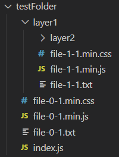

# glob 語法測試

## 檔案放置結構


## 常用的語法
- 選擇所有資料夾的所有檔案 + 所有資料夾
  - `**/*`
  - npm glob 套件的話搭配 `nodir: true` 可不要出現資料夾名稱，達成選取所有資料夾內所有檔案的效果
    ```js
    const files = await glob(pattern, {
      ignore: "node_modules/**",
      nodir: true,
    });
    ```
- 選擇所有資料夾的所有 js 檔
  - `**/*.js`
- 選擇所有資料夾的所有 min 檔
  - `**/*.min.*`
- 選擇所有資料夾的所有 node_modules 資料夾
  - `**/node_modules`

## 不同的 selector
### `/` 結尾
- `/`  
  ```js
  [ 'D:\\' ]
  ```
- `*/`  
  ```js
  [ 'layer1' ]
  ```
  - 取得下一層資料夾名稱
- `**/`  
  ```js
  [ 
    '.',
    'layer1',
    'layer1\\layer2'
  ]
  ```
  - 取得所有資料夾名稱
### `*` 或 `**` 結尾
- `*`  
  同層資料夾 所有檔案名稱  
  同層資料夾 所有資料夾名稱
  ```js
  [
    'layer1',
    'index.js',
    'file-0-1.txt',
    'file-0-1.min.js',
    'file-0-1.min.css'
  ]
  ```
- `**`  
  所有檔案名稱  
  所有資料夾名稱(包含此資料夾，會使用 `.` 來表示)
  ```js
  [
    '.',
    'layer1',
    'index.js',
    'file-0-1.txt',
    'file-0-1.min.js',
    'file-0-1.min.css',
    'layer1\\layer2',
    'layer1\\file-1-1.txt',
    'layer1\\file-1-1.min.js',
    'layer1\\file-1-1.min.css',
    'layer1\\layer2\\file-2-1.txt',
    'layer1\\layer2\\file-2-1.min.js',
    'layer1\\layer2\\file-2-1.min.css'
  ]
  ```
- `*/*`  
  下一層資料夾 資料夾名稱  
  下一層資料夾 所有檔案名稱
  ```js
  [
    'layer1\\layer2',
    'layer1\\file-1-1.txt',
    'layer1\\file-1-1.min.js',
    'layer1\\file-1-1.min.css'
  ]
  ```
- `*/**`  
  下 n 層資料夾 資料夾名稱  
  下 n 層資料夾 所有檔案名稱
  ```js
  [
    'layer1',
    'layer1\\layer2',
    'layer1\\file-1-1.txt',
    'layer1\\file-1-1.min.js',        
    'layer1\\file-1-1.min.css',       
    'layer1\\layer2\\file-2-1.txt',   
    'layer1\\layer2\\file-2-1.min.js',
    'layer1\\layer2\\file-2-1.min.css'
  ]
  ```
- `**/*`  
  所有檔案名稱  
  所有資料夾名稱(除了自身，可和 selector `**` 比較)
  ```js
  [
    'layer1',  
    'index.js',
    'file-0-1.txt',
    'file-0-1.min.js',
    'file-0-1.min.css',
    'layer1\\layer2',
    'layer1\\file-1-1.txt',
    'layer1\\file-1-1.min.js',
    'layer1\\file-1-1.min.css',
    'layer1\\layer2\\file-2-1.txt',
    'layer1\\layer2\\file-2-1.min.js',
    'layer1\\layer2\\file-2-1.min.css'
  ]
  ```
- `**/**`  
  所有檔案名稱(效果與 selector `**` 相同)  
  所有資料夾名稱
  ```js
  [
    '.',
    'layer1',
    'index.js',
    'file-0-1.txt',
    'file-0-1.min.js',
    'file-0-1.min.css',
    'layer1\\layer2',
    'layer1\\file-1-1.txt',
    'layer1\\file-1-1.min.js',
    'layer1\\file-1-1.min.css',
    'layer1\\layer2\\file-2-1.txt',
    'layer1\\layer2\\file-2-1.min.js',
    'layer1\\layer2\\file-2-1.min.css'
  ]
  ```

### 副檔名結尾
- `*.txt`  
  ```js
  [ 'file-0-1.txt' ]
  ```
- `**.txt`  
  ```js
  [ 'file-0-1.txt' ]
  ```
- `*/*.txt`  
  ```js
  [ 'layer1\\file-1-1.txt' ]
  ```
- `*/**.txt`  
  ```js
  [ 'layer1\\file-1-1.txt' ]
  ```
- `**/*.txt`  
  ```js
  [
    'file-0-1.txt',
    'layer1\\file-1-1.txt',
    'layer1\\layer2\\file-2-1.txt'
  ]
  ```
- `**/**.txt`  
  ```js
  [
    'file-0-1.txt',
    'layer1\\file-1-1.txt',
    'layer1\\layer2\\file-2-1.txt'
  ]
  ```
- `*.min.*`  
  ```js
  [
    'file-0-1.min.js',
    'file-0-1.min.css'
  ]
  ```
- `**/*.min.*`  
  ```js
  [
    'file-0-1.min.js',
    'file-0-1.min.css',
    'layer1\\file-1-1.min.js',
    'layer1\\file-1-1.min.css',
    'layer1\\layer2\\file-2-1.min.js',
    'layer1\\layer2\\file-2-1.min.css'
  ]
  ```